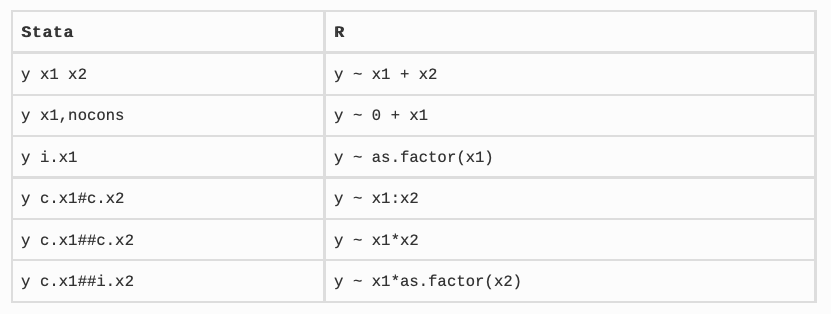
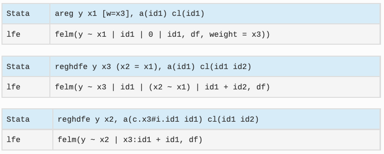

```{r setup, include=FALSE}
# load packages
library(pacman)
pacman::p_load(tidyverse,lfe,plm,AER,margins,stargazer,outreg,listviewer,estimatr) # cargar y/o instalar paquetes a usar

# option html
options(htmltools.dir.version = FALSE)
knitr::opts_chunk$set(fig.align="center", fig.height=4 , dpi=300 , cache=T)

## My preferred ggplot2 plotting theme (optional)
theme_set(hrbrthemes::theme_ipsum())
```

## Ya vimos

1. Crear funciones en R - [[Ver repositorio aquí]](https://github.com/taller-R/clase_7)

--

## Hoy veremos 

1. [Regresiones básicas](#intro)

    1.1. Sintaxis
    
    1.2. Funciones `lm()` y `glm()`
    
2. [Posestimaciones](#post)

    2.1. Gráficos

    2.2. Tablas

3. [Datos panel y IV](#felm)

   3.1. Función `felm()`

<!--------------------------->
<!--- Regresiones básicas --->
<!--------------------------->
---
class: inverse, center, middle
name: intro
# Regresiones básicas

<html><div style='float:left'></div><hr color='#FF007F' size=1px width=796px></html>

---
# Sintaxis

<div align="center">

</div>
Tomado de: [R for Stata Users](http://r4stats.com/books/r4stata/)

---
# Funciones `lm()` y `glm()`

```{r,eval=F,include=T}
# Estimaciones OLS
lm(formula = y ~ x1 + x2 ... + xn , data = db)
lm(formula = db$y ~ db$x1 + db$x2 ... + db$xn)

# Estimaciones por GLM 
glm(formula = y ~ x1 + x2 ... + xn , data = db , family  = binomial(link = "logit"))
glm(formula = y ~ x1 + x2 ... + xn , data = db , family = poisson(link = "log"))
```

- Donde `y` es la variable dependiente o explicada y `x1`..`xn` son las variables independientes o explicativas. 

- Tanto `lm()` como `glm()` tienen otros argumentos que pueden ser explorados usando la opción `?lm` y `?glm`.

---
# Veamos un ejemplo (...)
```{r,eval=T,include=T}
# Cargar datos
library(gapminder)
gapminder
```

---
# Veamos un ejemplo (...)

Veamos la correlación entre expectiva de vida y PIB percapita 

```{r,eval=T,include=T}
lm(lifeExp ~ gdpPercap , data = gapminder) %>% summary() 
```

---
# Veamos un ejemplo (...)

Podemos crear un objeto que almacene la información de la regresión 

```{r,eval=T,include=T}
ols = lm(lifeExp ~ gdpPercap , data=gapminder)
class(ols) # Un objeto "lm" que almacena la información de la regresión
ols$call # modelo estimado
ols$coefficients #  un vector con los coeficientes del modelo 
ols$na.action # observaciones para las que hay NA 
summary(ols)$r.squared # R^2
summary(ols)$adj.r.squared # R^2 ajustado
```

---
# Veamos un ejemplo (...)

Vamos a extraer los outlier...

```{r,eval=T,include=T}
ggplot() + geom_point(data=gapminder%>%subset(gdpPercap<50000) , 
                      aes(y=lifeExp, x=gdpPercap)) +
geom_point(data=gapminder%>%subset(gdpPercap>50000) , 
           aes(y=lifeExp, x=gdpPercap) , col="red")
  
```

---
# Veamos un ejemplo (...)

```{r,eval=T,include=T}
# Vamos a extraer los datos con GDP mayor a 50000
ols2 = lm(lifeExp ~ gdpPercap , data=gapminder , 
          subset = gdpPercap <50000)

# Comparemos los R^2
summary(ols)$adj.r.squared # R^2 ajustado
summary(ols2)$adj.r.squared # R^2 ajustado
```

---
# Errores estandar robustos

Corregir los errores estandar de la regresión...

```{r,eval=T,include=T}
# erriores robustos
ols_robust = lm_robust(lifeExp ~ gdpPercap , data=gapminder , subset = gdpPercap <50000)

# Comparemos los resultados
summary(ols2)$coefficients # SE con lm()
summary(ols_robust)$coefficients[,1:4] # SE con lm_robust() 
```

<!----------------------->
<!--- Posestimaciones --->
<!----------------------->
---
class: inverse, center, middle
name: post
# Posestimaciones

<html><div style='float:left'></div><hr color='#FF007F' size=1px width=796px></html>

---
# Residuales
```{r,eval=T,include=T}
# Veamos la distribución de los residuos de la regresión
ols  = lm(lifeExp ~ gdpPercap , data=gapminder , subset = gdpPercap <50000)
ols$residuals %>% hist()
```

---
# Valores predichos (...)
```{r,eval=T,include=T}
# Veamos los valores predichos
data = gapminder %>% subset(gdpPercap <50000)
data$lifeExp_gorro = predict(object = ols,newdata=data)
data
```

---
# Valores predichos (...)

```{r,eval=T,include=T}
# Veamos los valores predichos
ggplot(data = data , aes(x=gdpPercap,y=lifeExp)) + 
geom_point() + geom_smooth(method = lm)
```

---
# Coef plot
```{r,eval=T,include=T}
library(margins) ; library(broom) 
ols2 = lm(lifeExp ~ -1 + gdpPercap , data=gapminder) 
tidy(ols2, conf.int = TRUE) %>% 
ggplot(aes(x=term, y=estimate, ymin=conf.low, ymax=conf.high)) +
geom_pointrange() + geom_hline(yintercept = 0, col = "orange") 
```

---
# outreg
```{r,eval=T,include=T}
library(outreg) 
outreg(ols)
```


<!------------------------>
<!--- Datos panel y IV --->
<!------------------------>
---
class: inverse, center, middle
name: felm
# Datos panel y IV

<html><div style='float:left'></div><hr color='#FF007F' size=1px width=796px></html>

---
# Función `felm()`

<div align="center">

</div>
Tomado de: [R for Stata Users](http://r4stats.com/books/r4stata/)


---
# Función `felm()`
```{r,eval=T,include=T}
felm_model = felm(lifeExp ~ gdpPercap | country + year | 0 | country , data = gapminder)
felm_model %>% summary()
```

<!--------------------->
<!---    Hoy vimos  --->
<!--------------------->
---
class: inverse, center, middle

# Hoy vimos...
<html><div style='float:left'></div><hr color='#FF007F' size=1px width=796px></html>

---
#  Hoy vimos...

- ☑ [Regresiones básicas](#intro)

- ☑ [Posestimaciones](#post)

- ☑ [Datos panel y IV](#felm)
   
  
---
# Vamos a R para aplicar los conceptos vistos en clase...

<div align="center">

</div>
